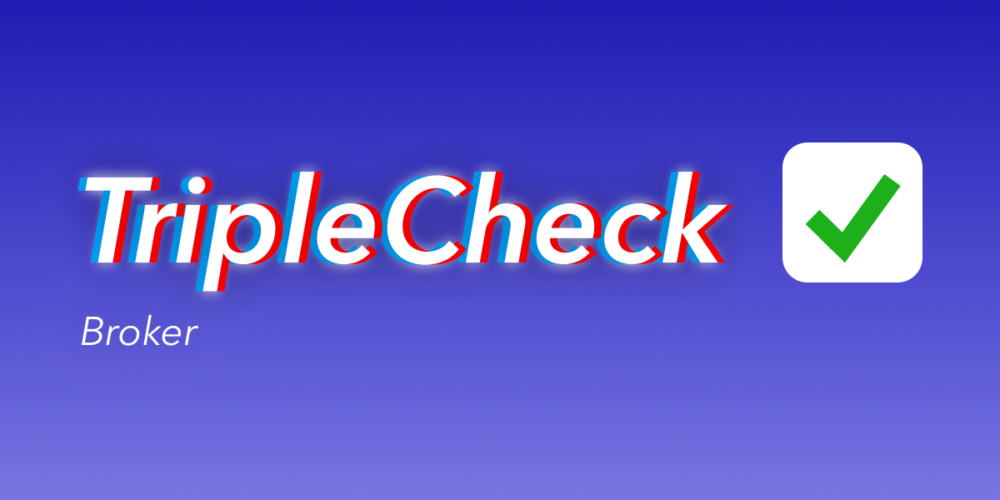

# triplecheck-broker




[](https://sonarcloud.io/dashboard?id=mikaelvesavuori_triplecheck-broker)

[](https://codescene.io/projects/15675)

[](https://codescene.io/projects/15675)

## TripleCheck broker — The easiest and fastest way to do contract testing.

The TripleCheck broker is a central, global store for all of your contracts and contract tests. You need to run the broker with a [(database) repository of your choice](#available-database-repositories). There are also a number of [ready-made solutions](#quickstart-using-example-implementations) if you prefer Easy Street.

The [triplecheck-cli](https://github.com/mikaelvesavuori/triplecheck-cli) will abstract the use of the broker so you can kick back and relax. You can use the broker without the CLI, though its usefulness is not nearly as interesting without it. Conversely, there are probably some interesting things you can do with the broker being "open" like any other API.

## Quickstart using example implementations

There are several implementations that you can use ready-to-go or as your own starter kit. The current list is:

- [Google Cloud Run and Firestore](https://github.com/mikaelvesavuori/triplecheck-example-cloudrun)
- [Google Cloud Functions and Firestore](https://github.com/mikaelvesavuori/triplecheck-example-cloud-functions)
- [Cloudflare Workers and KV](https://github.com/mikaelvesavuori/triplecheck-example-cloudflare-workers)
- [AWS Lambda with DynamoDB](https://github.com/mikaelvesavuori/triplecheck-example-lambda)
- [Vercel with FaunaDB](https://github.com/mikaelvesavuori/triplecheck-example-vercel)
- [Netlify with FaunaDB](https://github.com/mikaelvesavuori/triplecheck-example-netlify)

Examples for Azure Container Instances and Azure Functions are being produced but got delayed and botched because of typical Microsoft issues, so that's why they are not in the first block of examples.

The easiest way to get going with starter code is by using [degit](https://github.com/Rich-Harris/degit). degit makes it very convenient to pull a shallow clone from Git without all the history and other garbage you get when cloning repose. The format is:

```
npx degit {github-user}/{github-repo} {your-folder}
```

So, actually downloading a TripleCheck example would therefore look like:

```
npx degit mikaelvesavuori/triplecheck-example-cloudrun my-cloudrun-broker
```

## Available database repositories

The broker requires a "repository", i.e. a piece of code that will drive the database.

Examples above already use some of these. If you're keen on writing your own broker implementation, you might want to use one of the available repositories:

- [Azure CosmosDB SQL](https://github.com/mikaelvesavuori/triplecheck-repository-cosmosdb-sql)
- [Google Firestore](https://github.com/mikaelvesavuori/triplecheck-repository-firestore)
- [Cloudflare KV](https://github.com/mikaelvesavuori/triplecheck-repository-cloudflarekv)
- [AWS DynamoDB](https://github.com/mikaelvesavuori/triplecheck-repository-dynamodb)
- [FaunaDB](https://github.com/mikaelvesavuori/triplecheck-repository-fauna)

## How do I get started setting up my own broker from scratch?

It's pretty easy and do feel free to look at some of the examples for practical references.

The general gist is that you will need to import the broker, a repository of your choice (see above), and then run the broker with the repository as one of its arguments. The other arguments are `request` and `payload`: `request` being a slightly processed request object (implementation depends on your compute/API context—see the implementations for how they behave) and the `payload` is simply a parsed JSON object of any request body you may have.

Some databases require environmental context (variables etc.) and/or keyfiles or explicit configuration objects. Look at the respective repository's documentation to learn what is expected.

## Example requests

These are also available in Insomnia format in the repo.

### Publish

#### Publish #1

```json
POST {{BROKER_URL}}/publish

{
  "identity": {
    "name": "user-api",
    "version": "1.1.0"
  },
  "dependencies": [
    "payments-service@1.3.0"
  ],
  "contracts": [
    {
      "user-api": {
        "1.1.0": {
          "name": "Someone",
          "address": "Some Street 123",
          "age": 35
        }
      }
    }
  ],
  "tests": [
    {
      "user-api": {
        "1.1.0": [
          {
            "Verify identity": {
              "name": "Carmen",
              "address": "Ocean View 3000",
              "age": 27
            }
          }
        ]
      }
    }
  ]
}
```

#### Publish #2

```json
POST {{BROKER_URL}}/publish

{
  "identity": {
    "name": "payments-service",
    "version": "1.3.0"
  },
  "dependencies": [],
  "contracts": [
    {
      "payments-service": {
        "1.3.0": {
          "userId": "string",
          "invoiceId": "string",
          "paidInFull": false
        }
      }
    }
  ],
  "tests": [
    {
      "payments-service": {
        "1.3.0": [
          {
            "User payment update": {
              "userId": "823hc73nca",
              "invoiceId": "828612-10273-eff",
              "paidInFull": true
            }
          }
        ]
      }
    }
  ]
}
```

### Services

#### Get services

```
GET {{BROKER_URL}}/services
```

#### Get service

```
GET {{BROKER_URL}}/services?payments-service
```

### Relations

#### Get dependencies

```
GET {{BROKER_URL}}/dependencies
```

#### Get dependencies of given service

```
GET {{BROKER_URL}}/dependencies?user-api
```

#### Get dependencies of given service version

```
GET {{BROKER_URL}}/dependencies?user-api@1.0.0
```

#### Get dependents

```
GET {{BROKER_URL}}/dependents
```

#### Get dependents of given service

```
GET {{BROKER_URL}}/dependents?payments-service
```

#### Get dependents of given service version

```
GET {{BROKER_URL}}/dependents?payments-service@1.3.0
```

### Contracts

#### Get contracts

```
GET {{BROKER_URL}}/contracts
```

#### Get contract

```
GET {{BROKER_URL}}/contracts?user-api@1.0.0
```

#### Delete contract

```json
DELETE {{BROKER_URL}}/contracts

{
  "serviceName": "user-api",
  "version": "1.0.0"
}
```

### Tests

#### Get tests

```
GET {{BROKER_URL}}/tests
```

#### Get test

```
GET {{BROKER_URL}}/tests?payments-service@1.3.0
```

#### Delete tests for version of service

```json
DELETE {{BROKER_URL}}/tests

{
  "serviceName": "payment-service",
  "version": "1.3.0"
}
```

#### Delete test

```json
DELETE {{BROKER_URL}}/tests

{
  "serviceName": "payments-service",
  "version": "1.3.0",
  "test": "User payment update"
}
```
